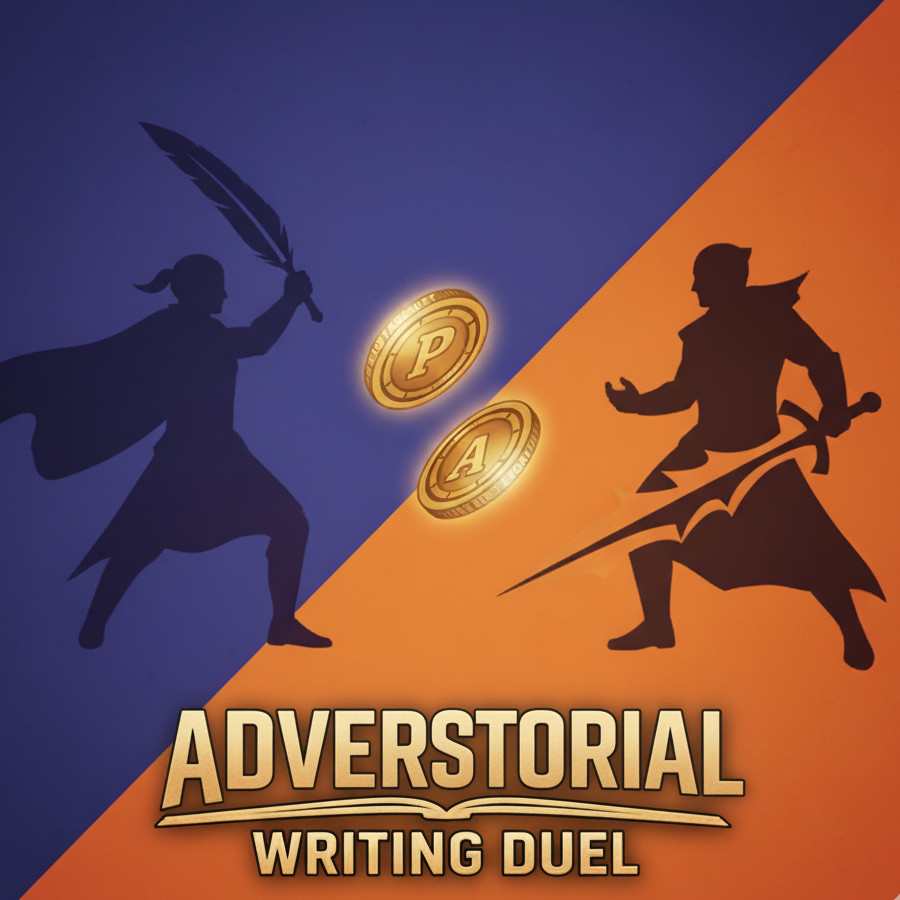

# Adverstorial
_Adversary Story Writing Duel_



## Instructions

This is a writing game to generate a short story where the writer players attempt to make their side (protagonist or antagonist) the most interesting in order to win\! It’s called *Adverstorial*.

### Structure

* 2 player writers represent either the protagonist (good) or antagonist (evil) of the story.
* A coin-flip starts the game to pick which player goes first.
* Turn 1: Player receives seed text for inspiration and writes a complete short story.
* Turn 2+: Player rewrites, edits and expands the story while preserving its beginning and end.
* The story at each turn must always be whole: title, comprehensive plot, and conclusion.
* After the final round, the story is read and judged.
* The side that is deemed the most interesting wins (not necessarily the "one that lives")!

### Rules
Violating any of the following will cause a player to lose their turn and their edits to be discarded.

* Keep it within a dozen paragraphs! This is a short story, not a novel.
* Story title must not changed once the first player writes it.
* The beginning and ending of the story must stay essentially the same; it is the middle parts that can be expanded upon to add new scenes.
* Facts must not be removed or materially altered.
* Names and personalities cannot change once established.
* Scenes must flow in the same order.
* Story must always be complete with a beginning, middle, and _conclusion_.
* Avoid referring to yourself or your writing adversary.
* Do NOT call out the protagonist or antagonist in the story; it is inferred through context.

### Tips

* Facts MAY be embellished or downplayed to change their effect on the reader. This is also true of the beginning and conclusion of the story which must nevertheless remain factually consistent.
* The protagonist and antagonist may not be traditional anthropomorphic heroes or villains; it depends on the story! A single character could be struggling with an antagonistic side within themselves or society or some environmental factor.  
* Creating dialogs and direct encounters between the protagonist and antagonist can make for a fun “writing duel”.  
* Remember you can affect all parts of the story from the theme, the setting, other characters, dress, mood, style, etc. and not just direct attributes of your chosen side.  
* Keeping to the mood of the story can help build more emotional intensity whether it’s happy, sad, funny, or all of the above. Giving the judge an emotional adventure is more potent than mere tag lines.  
* Make your side more sympathetic by making them more humanly relatable.  
* The seed is *not* a plot or a title, it is just inspiration to write the story. Try to adapt it creatively!

### Format

Every turn must output this format:

```
Title: <title>

<beginning>

<middle>

<conclusion>

The End
```

You MUST output The End on its own line without any punctuation.

## Future Ideas

### Adversaries

* Personalities
* Self-Definition (Who Am I?)

### Game Structure

* Q&A - gather facts separate from the story itself

### Flair

* Cover Image Battle?
